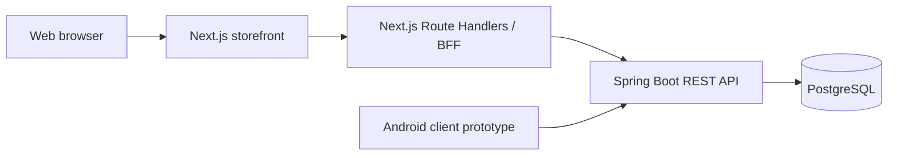

# Logistic Platform


An e-commerce and logistics platform portfolio project. It contains a Spring Boot API, a Next.js web storefront with a
thin Backend for Frontend (BFF), and an Android client prototype.

## Architecture



The BFF is a web-specific layer. The browser calls relative endpoints on the Next.js application; the BFF calls Spring
Boot through the internal Docker network. This keeps the backend URL out of browser code and provides a place for
web-only authentication, response shaping, and data aggregation.

Current BFF endpoint:

| Web endpoint      | Spring Boot endpoint   | Purpose                              |
|-------------------|------------------------|--------------------------------------|
| `GET /api/health` | `GET /actuator/health` | Backend health status for the web UI |

The Android client is intended to call the shared Spring Boot API directly. It should not depend on the web BFF.

## Components

| Component      | Location                | Technology                    | Current responsibility                       |
|----------------|-------------------------|-------------------------------|----------------------------------------------|
| Backend API    | `src/`                  | Java 21, Spring Boot, JPA     | Product REST API, persistence, health checks |
| Web storefront | `frontend/`             | Next.js 16, React, TypeScript | Storefront UI and status page                |
| Web BFF        | `frontend/src/app/api/` | Next.js Route Handlers        | Web-to-backend proxy endpoints               |
| Android client | `android/`              | Kotlin, Jetpack Compose       | Mobile application prototype                 |
| Database       | Docker / Kubernetes     | PostgreSQL 17, Flyway         | Persistent storage and schema migrations     |

## Implemented Features

- Product CRUD REST API
- PostgreSQL integration with Flyway migrations
- Spring Boot Actuator health endpoint
- Next.js web frontend
- Next.js BFF health endpoint used by the `/status` page
- Android Jetpack Compose application prototype
- Docker Compose development environment
- Kubernetes manifests and deployment script
- GitHub Actions CI: backend tests, Android tests, container smoke test, and image publishing

## Project Structure

```text
.
|- src/                              # Spring Boot application
|  |- main/java/org/example/logisticplatform/
|  |  |- product/                    # Product domain and REST controller
|  |  `- config/
|  `- main/resources/db/migration/   # Flyway migrations
|- frontend/                         # Next.js web storefront
|  `- src/app/
|     |- api/health/route.ts         # Web BFF endpoint
|     `- status/page.tsx             # Uses /api/health
|- android/                          # Kotlin / Jetpack Compose prototype
|- k8s/                              # Kubernetes manifests
|- compose.yaml                      # Local multi-container environment
`- .github/workflows/ci-cd.yml       # CI/CD workflow 
```

## API

| Method   | Endpoint             | Description                |
|----------|----------------------|----------------------------|
| `GET`    | `/api/products`      | Get all products           |
| `GET`    | `/api/products/{id}` | Get product by ID          |
| `POST`   | `/api/products`      | Create a product           |
| `PUT`    | `/api/products/{id}` | Replace a product          |
| `PATCH`  | `/api/products/{id}` | Partially update a product |
| `DELETE` | `/api/products/{id}` | Delete a product           |
| `GET`    | `/actuator/health`   | Spring Boot health check   |

## Run Locally

### Requirements

- Docker Desktop with Docker Compose
- Java 21 for running the backend without Docker
- Node.js 20+ for running the frontend without Docker
- Android Studio for the Android prototype

Start the full local environment:

```bash
docker compose up --build --detach
```

Available services:

| Service                     | URL                                     |
|-----------------------------|-----------------------------------------|
| Web storefront              | `http://localhost:3000`                 |
| Web status page             | `http://localhost:3000/status`          |
| Web BFF health endpoint     | `http://localhost:3000/api/health`      |
| Spring Boot API             | `http://localhost:8080`                 |
| Spring Boot health endpoint | `http://localhost:8080/actuator/health` |

View logs:

```bash
docker compose logs --follow frontend
```

Stop the environment:

```bash
docker compose down
```

## Development Notes

The frontend container receives `BFF_BACKEND_URL=http://app:8080`. `app` is the Spring Boot service name inside the
Docker Compose network.

When a new Next.js route is added, rebuild the frontend image:

```bash
docker compose up --build --detach frontend
```

In development, React Strict Mode may issue the health request twice. This is expected for `useEffect` and does not
occur in a production build.

## Roadmap

- [ ] Introduce DTOs, validation, and global exception handling
- [ ] Add categories, suppliers, warehouses, inventory, and orders
- [ ] Add authentication and authorization
- [ ] Build Android catalog and authentication screens
- [ ] Add BFF endpoints for web-specific home, cart, and checkout views
- [ ] Document the API with OpenAPI / Swagger
- [ ] Add integration and end-to-end tests

## License

This project is licensed under the [BSD 2-Clause License](LICENSE).
